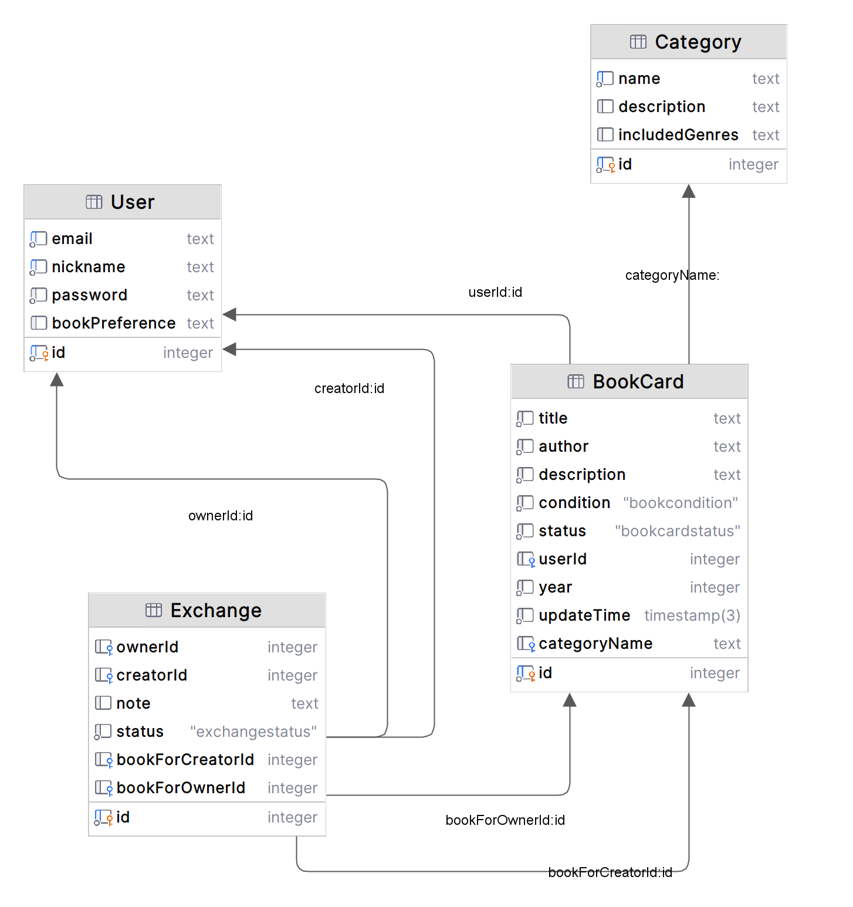

## Bookcrossing website

Сайт для обмена книгами между пользователями.

## Описание сущностей

* <b>Пользователь (User)</b> - роль, зарегистрирован на сайте и имеет свой профиль (доступ имеет только к своему профилю)
* Пользователь-инициатор (Creator) - пользователь, выбравший книгу на сайте, предложивший свою взамен. Создатель обмена
* Пользователь-владелец (Owner) - обладатель книги, получивший предложение об обмене

* <b>Обмен (Exchange)</b> - сущность, которая связывает две разные книги и двух разных пользователей. Один из пользователей создает обмен, выбирая последовательно, что он хочет получить и что предлагает взамен. Второй пользователь отказывается или соглашается.
* Статус Обмена (ExchangeStatus) - <i>Enum</i> - статус обмена в системе. Принимает следующие значения:
    * <code>активный (active)</code> - обмен был создан, ожидается ответ пользователя-владельца
    * <code>отвергнутый (rejected)</code> - пользователь-владелец отказался от данного обмена
    * <code>завершенный (completed)</code> - пользователь-владелец согласился и обмен был успешно завершен
* <b>Категория (Category)</b> - сущность, содержащая набор книг, относящихся к конкретной теме. Категории создаются и редактируются только админом, пользователи могут выбрать одну из уже имеющихся на сайте категорий, в которую следует поместить создаваемую ими книгу. Смысл категорий в упрощении поиска и систематизации книжных карточек на основной странице сайта.

* <b>Книжная карточка (BookCard)</b> - набор информации о книге, предложенный пользователем-владельцем. Включает в себя название, автора, описание (обычно аннотация), год издания, оценку состояния и фотографию книги
* Состояние книги (BookCondition) - <i>Enum</i> - оценка состояния в котором находится книга. Принимает значения:
    * <code>новое (new)</code>
    * <code>отличное (great)</code>
    * <code>хорошее (good)</code>
    * <code>приемлемое (acceptable)</code>
    * <code>плохое (bad)</code>
* Статус книги в системе (BookCardStatus) - <i>Enum</i> - показывает доступность книжной карточки для разных групп пользователей. Принимает следующие значения:
    * <code>на модерации (moderation)</code> - доступна только пользователю-автору карточки и модераторам, не опубликована для всех
    * <code>активна (active)</code> - опубликована на сайте, доступна для просмотра всем пользователям, для обмена - всем зарегистрированным
    * <code>скрыта (concealed)</code> - книга уже была обменяна и остается видима только участникам завершенного обмена
